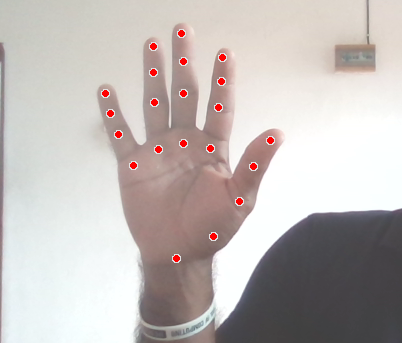
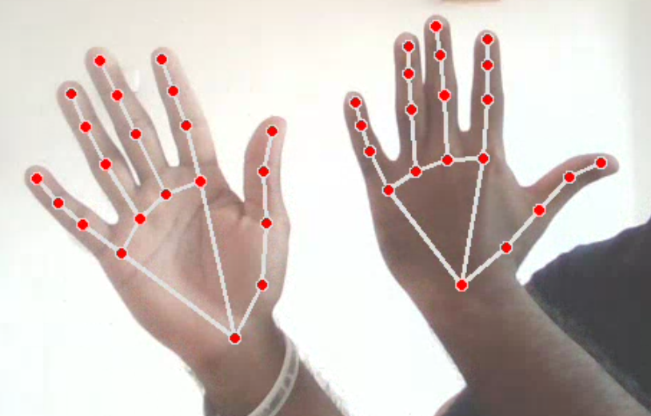
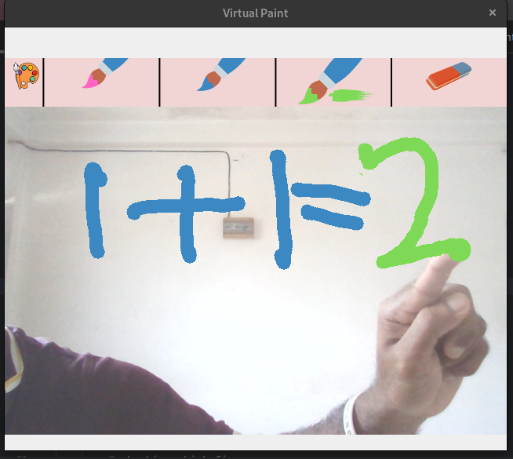
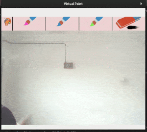
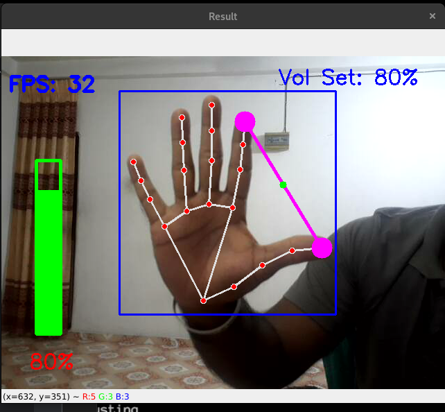
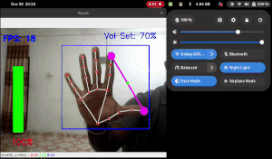
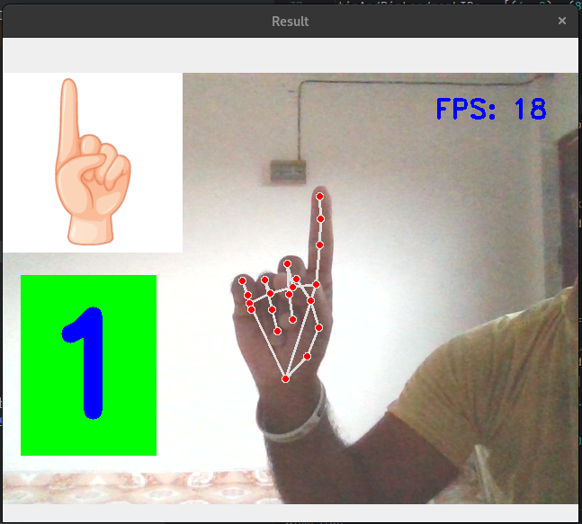

# Hand-Tracking_OpenCV

## Real-time Hand Tracking using Google media-pipe with OpenCV and Python
## Custom module from scratch to get coordinates of landmarks of a hand

- This contains a custom Python module that can be used to detect and track hands in real-time 
- Also by this, you can get the coordinates of the 21 landmarks of a hand (defined by Google mediapipe) as a list and use in other projects  
- Works well even only using the CPU

## Small Projects using above module
### 1. Virtual Painter  
- Use index and middle finger to select the tool
- use index finger to draw adn erase after selection
- ( screenshots and gifs are available below) 
### 2. Volume control using hand gesture (Advanced)
- Use thumb and index finger to indicate the volume percentage
- Fold the ring finger to set the volume at desired level
- ( screenshots and gifs are available below) 
### 3. Finger Counter 
- Can use to count from 0 to 5
- ( screenshots and gifs are available below) 

## Some Screenshots:  

  

  
21 Landmarks: 

  

## Project Captures
### 1. Virtual Paint :

 Gif: 

### 2. Volume Control using gestures :

 Gif: 

### 3. Finger Counter :

 Gif: 

