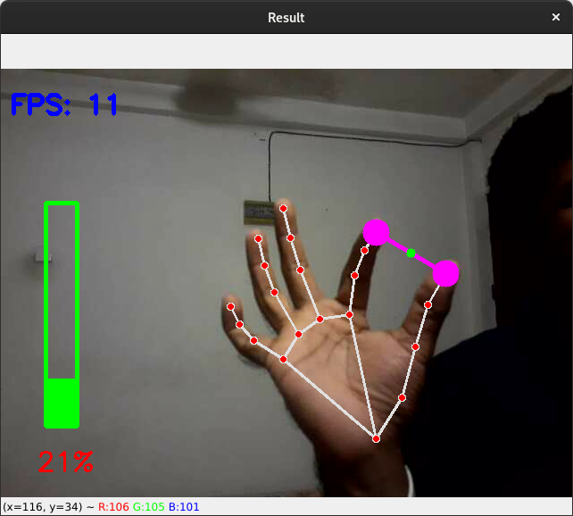

# Hand-Tracking_OpenCV

## Real-time Hand Tracking using Google media-pipe with OpenCV and Python
## Custom module to get coordinates of landmarks of a hand

- This contains a custom Python module that can be used to detect and track hands in real-time 
- Also by this, you can get the coordinates of the 21 landmarks of a hand (defined by Google mediapipe) as a list and use in other projects  
- Works well even only using the CPU

## Small Projects using above module
- Virtual Painter  ( screenshots and gifs are available below) 
- Volume control using hand gesture ( screenshots and gifs are available below) 
- Finger Counter ( screenshots and gifs are available below) 

## Some Screenshots:  

  

  
21 Landmarks: 

  

## Project Captures
### VVirtual Paint :

 Gif: 

### Volume Control using gestures :

 Gif: 

### Finger Counter :

 Gif: 

