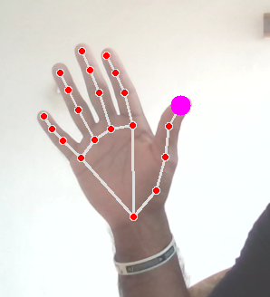

# Hand-Tracking_OpenCV

## Real-time Hand Tracking using Google media-pipe with OpenCV and Python
## Custom module to get coordinates of landmarks of a hand

- This contains a custom Python module that can be used to detect and track hands in real-time 
- Also by this, you can get the coordinates of the 21 landmarks of a hand (defined by Google mediapipe) as a list and use in other projects  
- Works well even only using the CPU

## Some Screenshots:  

  

  

  

21 Landmarks:

  
